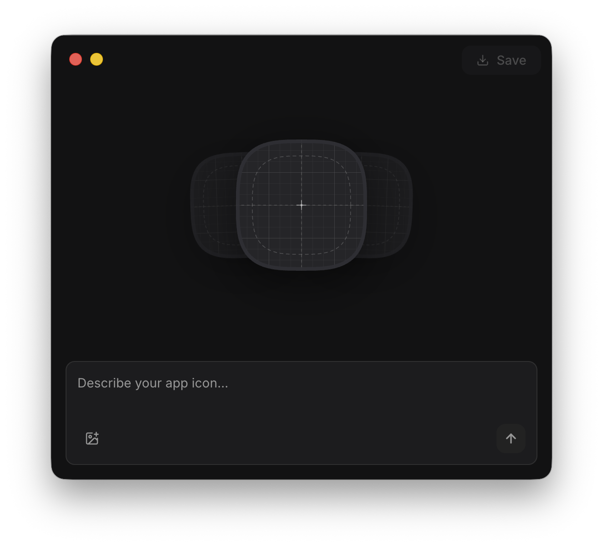

# App Icon Maker

Desktop app for generating **macOS app icons** with AI. You describe what you want (and optionally attach a reference image), pick from several variants, refine the chosen design, then save a proper **`.icns`** bundle (and companion **`.iconset`**) with all standard sizes.



Built with [MōBrowser](https://mobrowser.dev/).

## What it does

- **Prompt-based generation.** Your text is wrapped in fixed system constraints so outputs stay on-brand for macOS-style icons (centered subject, no text, squircle-friendly composition, and similar).
- **Three variants per run.** Each generation returns three images so you can compare quickly.
- **Optional reference image.** Attach a PNG to steer the model (for example a sketch, logo, or earlier render).
- **Refine workflow.** After you confirm one variant, you can run more generations that treat that icon as the reference until you are happy with the result.
- **Preview vs export.** The UI shows icons with a squircle mask for a realistic preview. The saved **`.icns`** uses full-bleed artwork so macOS can apply its own mask (avoiding the gray plate and shrunken icon you get from pre-clipped corners).
- **Save and reveal.** Save picks a destination, builds the icon set with **`sips`** and **`iconutil`**, and you can open the folder in Finder afterward.

Quitting with an unsaved icon triggers a confirmation dialog.

## Requirements

- **Node.js** matching `engines` in `package.json` (see there for supported major versions).
- **macOS** for development and for saving **`.icns`**: the main process uses **`sips`** and **`iconutil`**, which are part of macOS.
- An API key for the image provider you use (unless you use the mock provider).

## Setup

```bash
npm install
```

If you work on MōBrowser integration and need local API docs:

```bash
npm run gen
```

## Configure the image provider

The backend is selected with **`ICON_PROVIDER`**:

| Value              | API key | Notes                                                                                                                           |
| ------------------ | ------- | ------------------------------------------------------------------------------------------------------------------------------- |
| `openai` (default) | App preferences | On first launch an in-app dialog asks for your key and stores it locally (`prefs.json`). No environment variable is used.        |
| `mock`             | none    | Placeholder images for UI testing without billing.                                                                              |

Start the app as usual; when using OpenAI you will be prompted for an API key if none is saved yet:

```bash
npm run dev
```

For local UI work without APIs:

```bash
npm run dev:mock
```

## Run and build

- **`npm run dev`** — development mode (default provider: OpenAI if `ICON_PROVIDER` is unset).
- **`npm run dev:mock`** — same with **`ICON_PROVIDER=mock`**.
- **`npm run build`** — production build via MōBrowser.

## How to use the app

1. **Describe the icon** in the prompt field (short phrases work well: e.g. “blue clipboard with folded corner”).
2. **Optional:** attach a **reference image** to influence layout or style.
3. Press **Generate** (or **Enter**). Wait for **three** previews.
4. **Pick a variant** to move into refine mode, or generate again from scratch.
5. In **refine** mode, adjust the prompt and generate again; the confirmed icon is used as reference for the next batch.
6. When satisfied, click **Save**. Choose a **`.icns`** path; the app writes **`YourName.icns`** and **`YourName.iconset`** in that folder (replacing existing files only if you confirm).
7. Use **Reveal in Finder** from the success UI if you want to open the save location.

Light and dark appearance follow the in-app theme control (synced with the MōBrowser window chrome).

## Project layout (high level)

- **`src/main/`** — window, IPC, prompt building, provider selection, **`icns`** assembly.
- **`src/renderer/`** — React UI, squircle preview, generation pipeline state.
- **`src/main/lib/providers/`** — OpenAI and mock implementations.
